<div align="center">



<br/>

```
> signal received.
> origin: unknown.
> status: building.
```

<sub>check back later.</sub>

<br/><br/>

<picture>
  <source media="(prefers-color-scheme: dark)" srcset="https://raw.githubusercontent.com/joogiebear/joogiebear/output/github-snake-dark.svg"/>
  <source media="(prefers-color-scheme: light)" srcset="https://raw.githubusercontent.com/joogiebear/joogiebear/output/github-snake.svg"/>
  
</picture>

</div>
